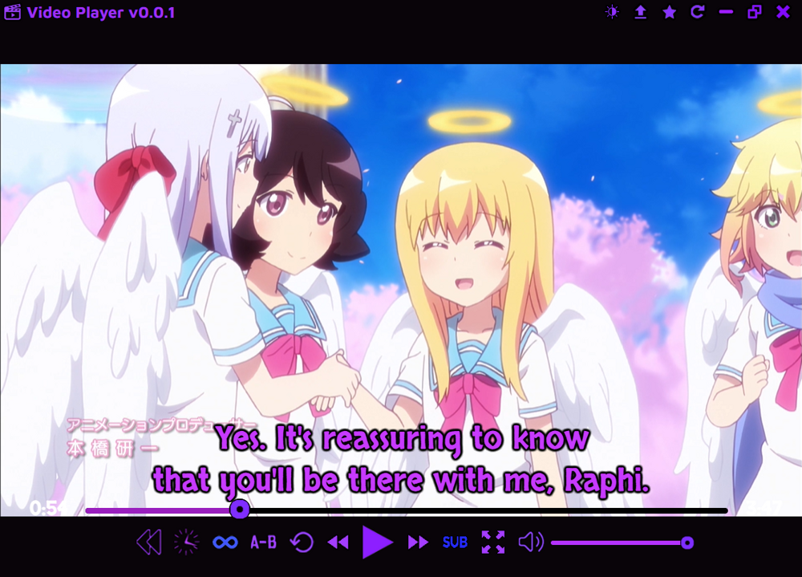

## Music Player

This is a music player that can apply cool effects such as reversing, time stretching, and pitch shifting in real-time.
It's basically the GUI version of my [Music Player Web](https://github.com/Tenpi/Music-Player-Web) site.

### Features:
- Play, pause, loop and seek audio
- Adjust the volume of the audio
- Reverse audio in real-time
- Time stretching in real-time (can either preserve or affect the pitch)
- Pitch shifting in real-time (only if time-stretch is set to not affect the pitch)
- Looping from point A to point B
- Play local files, YouTube videos, and Soundcloud tracks
- Render and download audio with effects
- Keeps a record of recent plays
- Play previous or next tracks (from your play history)

### Installation

Download the latest exe installer from the [releases](https://github.com/Tenpi/Music-Player/releases) tab. Updates can be installed automatically.

### Bugs and Requests

Open an issue on my GitHub repository.

### Also See

- [Music Player Web](https://github.com/Tenpi/Music-Player-Web)